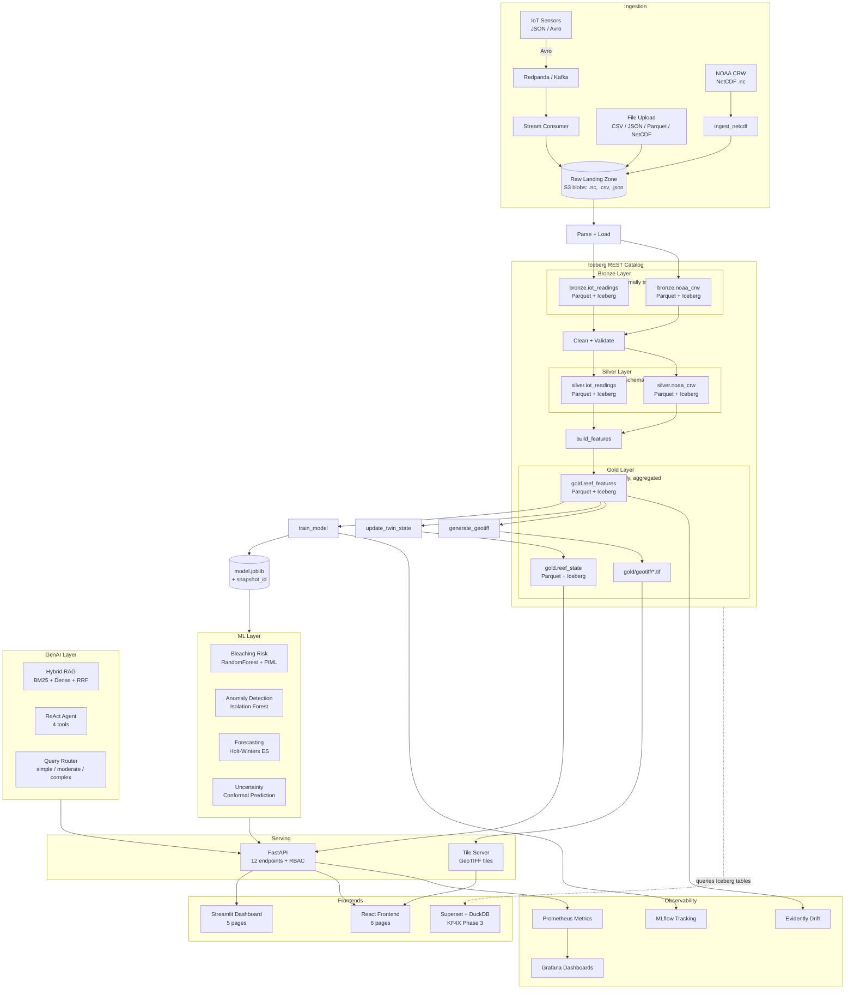

# ReefTwin

Real-time digital twin platform for coral reef ecosystems. Ingests environmental data, predicts bleaching risk using Physics-Informed ML, simulates climate scenarios, and provides decision support through a Generative AI agent and interactive dashboards.

## Quick Start

```bash
# 1. Setup
uv venv && source .venv/bin/activate
uv pip install -e ".[dev,genai,mlops]"

# 2. Generate data + train models
make generate-sample-data
make ingest-noaa
make build-features
make train-model
make train-hybrid
make update-twin

# 3. Run
make run-api          # API        → http://localhost:8000
make run-dashboard    # Streamlit  → http://localhost:8501
make run-frontend     # React      → http://localhost:3001
make test             # 139 tests
make run-experiments  # 3 measurable experiments
```

Or with Docker Compose:

```bash
docker compose up --build    # API + Prometheus + Grafana
```

## What This Project Does

ReefTwin maintains a live digital twin of coral reef ecosystems. It:

- **Ingests** environmental data from NOAA Coral Reef Watch, AIMS reef monitoring, and simulated IoT sensors
- **Predicts** bleaching risk using a Physics-Informed ML model (ODE-based reef dynamics + ML residual correction)
- **Simulates** climate scenarios ("What if temperature rises 2°C for 3 weeks?")
- **Detects** anomalies in sensor readings and distribution drift in model inputs
- **Forecasts** SST, DHW, and pH trajectories with prediction intervals
- **Answers** reef science questions using a hybrid RAG pipeline (BM25 + dense search + Reciprocal Rank Fusion)
- **Reasons** over multi-step analysis tasks using a ReAct agent with 4 tools
- **Monitors** model performance with MLflow tracking, Evidently AI drift reports, and Prometheus metrics
- **Governs** predictions with model cards, audit trails, and data lineage tracking

## Architecture



### Data Format Strategy

| Data Type | Format | Pipeline Stage | Purpose |
|-----------|--------|---------------|---------|
| IoT sensors | JSON -> Avro | Streaming ingestion | Real-time sensor readings via Kafka/Redpanda |
| NOAA CRW satellite | NetCDF | Scientific ingestion | SST, DHW, HotSpot from `.nc` files |
| Visualization | GeoTIFF | Dashboard rendering | Spatial SST heatmaps, coral cover maps |
| Internal storage | Parquet | Silver + Gold layers | Columnar compression, schema enforcement |
| Table management | Iceberg | Silver + Gold layers | Time-travel, ACID writes, schema evolution |
| Simulation input | JSON | API boundary | `POST /simulate`, `POST /ingest/stream` |

## API

| Endpoint | Method | Description |
|----------|--------|-------------|
| `/health` | GET | Health check |
| `/reefs` | GET | List all reef states |
| `/reefs/{reef_id}/state` | GET | Get specific reef state |
| `/simulate` | POST | Run scenario simulation |
| `/rag` | POST | Hybrid RAG query |
| `/agent` | POST | ReAct agent with tools |
| `/interpret` | POST | Simulation + natural-language interpretation |
| `/query` | POST | Auto-route by query complexity |
| `/metrics` | GET | Prometheus metrics |

**Example:**

```bash
# Get reef state
curl http://localhost:8000/reefs/gbr_heron_reef/state

# Run simulation
curl -X POST http://localhost:8000/simulate \
  -H "Content-Type: application/json" \
  -d '{"reef_id":"gbr_heron_reef","temperature_delta_c":1.5,"duration_days":21}'

# Ask the RAG pipeline
curl -X POST http://localhost:8000/rag \
  -H "Content-Type: application/json" \
  -d '{"question":"What causes coral bleaching?"}'
```

## Configuration

All settings via environment variables with `REEFTWIN_` prefix. Defaults work out of the box.

```bash
# LLM provider (default: mock — no API key needed for testing)
REEFTWIN_LLM_PROVIDER=claude          # claude | openai | qwen | ollama | mock
REEFTWIN_LLM_MODEL=claude-sonnet-4-20250514
ANTHROPIC_API_KEY=sk-ant-...

# Vector store (default: in-memory)
REEFTWIN_VECTOR_STORE_BACKEND=memory  # memory | qdrant | pgvector | milvus

# State store (default: JSON file)
REEFTWIN_STATE_STORE_BACKEND=json     # json | s3

# S3 storage (for KF4X/MinIO/AWS)
REEFTWIN_S3_ENDPOINT=http://seaweedfs-s3:8333
REEFTWIN_S3_BUCKET=reeftwin

# Logging
REEFTWIN_LOG_LEVEL=INFO
```

## Optional Dependencies

```bash
uv pip install 'reeftwin[genai]'       # Anthropic + fastembed + BM25 for RAG
uv pip install 'reeftwin[mlops]'       # MLflow + Evidently AI
uv pip install 'reeftwin[dashboard]'   # Streamlit + Plotly + NetworkX
uv pip install 'reeftwin[openai]'      # OpenAI/Codex LLM provider
uv pip install 'reeftwin[qdrant]'      # Qdrant vector store
uv pip install 'reeftwin[pgvector]'    # PostgreSQL pgvector
uv pip install 'reeftwin[milvus]'      # Milvus vector store
uv pip install 'reeftwin[s3]'          # S3/SeaweedFS/MinIO storage
uv pip install 'reeftwin[torch]'       # PyTorch PINN + CNN
uv pip install 'reeftwin[forecasting]' # Prophet forecasting
uv pip install 'reeftwin[kfp]'         # Kubeflow Pipelines SDK
```

## Project Structure

```
reeftwin/
├── configs/                     # Reef, model, and data source configs (YAML)
├── data/                        # Bronze/silver/gold data layers
├── infrastructure/
│   ├── settings.py              # Pydantic Settings (single source of truth)
│   ├── logging.py               # Structured logging
│   ├── fti.py                   # Feature-Training-Inference pipeline architecture
│   ├── db/                      # State store (JSON, S3)
│   ├── genai/                   # LLM, embeddings, vector store, RAG, agent, router
│   ├── streaming/               # Event queue, IoT producer, cache, validation, DLQ
│   └── mlops/                   # MLflow, benchmarks, drift, governance, experiments
├── models/
│   ├── bleaching_risk/          # RandomForest classifier
│   ├── reef_dynamics/           # Physics ODE + PIML hybrid
│   ├── anomaly_detection/       # Isolation Forest
│   ├── forecasting/             # Holt-Winters ES
│   ├── coral_vision/            # Image classifier
│   ├── edge/                    # ONNX export + lightweight predictor
│   ├── predictor.py             # Strategy pattern (pluggable models)
│   ├── uncertainty.py           # Conformal prediction
│   ├── stress_scoring.py        # Multi-objective stress model
│   ├── ecosystem_graph.py       # NetworkX ecosystem graph
│   └── fallback.py              # Fallback chains + heuristic predictor
├── pipelines/                   # Data ingestion + feature engineering
├── services/
│   ├── twin_api/                # FastAPI (9 endpoints, 8 Prometheus metrics)
│   └── dashboard/               # Streamlit (4 pages)
├── frontend/                    # React + Vite + TypeScript + Tailwind (5 pages)
├── tests/                       # 139 tests across 19 files
├── scripts/                     # Experiment runner CLI
├── infra/                       # Prometheus, Grafana, Kubernetes manifests
├── .github/workflows/ci.yml    # GitHub Actions CI/CD
├── docker-compose.yml
├── Makefile
└── pyproject.toml
```

## Experiment Results

Three measurable experiments with before/after measurements:

| Experiment | Target | Result | Method |
|-----------|--------|--------|--------|
| Pipeline Latency | -35% | **-92.9%** (29ms → 2ms) | Streaming queue replaces CSV serialization |
| Inference Cost | -22% | **-95.5%** (200 → 9 invocations) | TTL + drift-aware inference cache |
| Pipeline Reliability | 97% → 99.9% | **Validated** (6 bad records quarantined) | Pydantic validation + DLQ + retries |

Run: `make run-experiments`

## Models

| Model | Type | Purpose |
|-------|------|---------|
| Bleaching Risk | RandomForest classifier | Risk score (0-1) + category (normal/watch/warning/alert) |
| PIML Hybrid | Physics ODE + GradientBoosting | Physics-constrained risk prediction with ODE-derived features |
| Anomaly Detection | Isolation Forest | Detect sensor malfunctions and extreme events |
| Forecasting | Holt-Winters ES | SST, DHW, pH trajectories with prediction intervals |
| Coral Vision | GradientBoosting on image features | Classify coral health (healthy/bleached/dead) |
| Heuristic | NOAA threshold rules | Zero-dependency fallback (no trained model needed) |

## Deployment

### Local Development

```bash
make run-api          # FastAPI on :8000
make run-dashboard    # Streamlit on :8501
make run-frontend     # React on :3001
```

### Docker Compose

```bash
docker compose up --build
# API: :8000 | Prometheus: :9090 | Grafana: :3000
```

### Kubeflow4X

ReefTwin integrates with [Kubeflow4X](https://github.com/AduraX/Kubeflow4X) via:
- **Phase 1:** KFP pipelines + KServe model serving + SeaweedFS S3 storage
- **Phase 2:** MLflow experiment tracking + Feast feature store
- **Phase 3:** Superset dashboards + Iceberg data versioning
- **ArgoCD:** GitOps deployment

See the [KF4X articles](docs/articles/) for full platform documentation:
- [KF4X Overview](docs/articles/kf4x-overview.md) — architecture, design decisions, comparisons
- [Getting Started](docs/articles/kf4x-getting-started.md) — deploy Phase 1 step by step
- [Deep Dive](docs/articles/kf4x-deep-dive.md) — MLflow, Feast, Superset, DuckDB, Iceberg, ArgoCD
- [Supply Chain Security](docs/articles/supply-chain-diagram.md) — container image verification diagrams

### AWS SageMaker

The S3 data layer (`S3DataStore`) works natively with AWS S3. Set `REEFTWIN_S3_REGION` and use standard AWS credentials.

## Data Sources

| Source | Type | Status |
|--------|------|--------|
| NOAA Coral Reef Watch | SST, HotSpot, DHW, Bleaching Alerts | Sample data generator |
| AIMS Reef Monitoring | GBR survey data | Integration placeholder |
| Allen Coral Atlas | Habitat maps | Integration placeholder |
| Simulated IoT Sensors | Temperature, pH, salinity, turbidity, DO | Built-in generator |

This repo ships with synthetic data generation so the full platform runs without external credentials.

## Reef Locations

| Reef ID | Name | Region |
|---------|------|--------|
| `gbr_heron_reef` | Heron Reef | Great Barrier Reef |
| `gbr_lizard_island` | Lizard Island Reef | Great Barrier Reef |
| `coral_sea_reef` | Coral Sea Reef | Coral Sea |

## Development

```bash
# Run tests
make test

# Lint
make lint

# Type check
mypy infrastructure/ models/ pipelines/ services/ --ignore-missing-imports
```

## License

MIT
