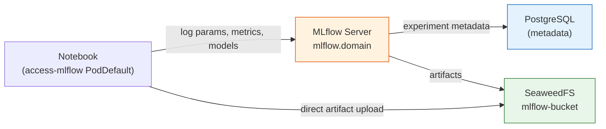
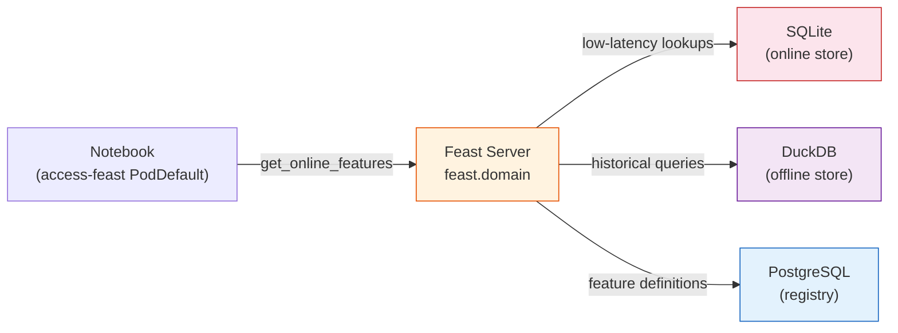
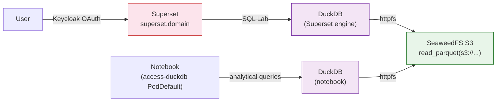
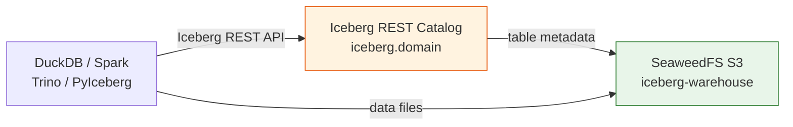
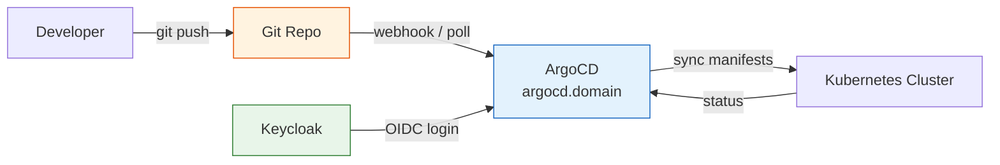

# KF4X Deep Dive: From Experiment Tracking to Data Lakehouse

*MLflow, Feast, Superset, DuckDB, Iceberg, and ArgoCD — the ML capabilities that make KF4X an enterprise platform.*


---

## Prerequisites

This article assumes you've completed the [Getting Started guide](kf4x-getting-started.md) — Kubeflow + Keycloak + SeaweedFS storage (Phase 1) are deployed.

---

## MLflow — Experiment Tracking (Phase 2)

MLflow tracks every training run, hyperparameter sweep, and model checkpoint.



*Figure: MLflow architecture — metadata in PostgreSQL, artifacts in SeaweedFS S3.*

### What Gets Deployed

- **MLflow server** at `https://mlflow.<domain>` (Keycloak-authenticated)
- **PostgreSQL** (shared: MLflow metadata + Feast registry)
- Artifacts stored in SeaweedFS S3 (`mlflow-bucket`)

### Deploy

```bash
cd Kubeflow4x_Phase-2
docker build -f mlflow/mlflow.dockerfile -t kf4x/mlflow:v2.22.1 mlflow/
cp config.env.example config.env && vi config.env
./install.sh
```

### Use It

Select the `access-mlflow` PodDefault when creating a notebook:

```python
import mlflow

mlflow.set_tracking_uri(os.getenv("MLFLOW_TRACKING_URI"))

with mlflow.start_run(run_name="my-experiment"):
    mlflow.log_param("learning_rate", 0.01)
    mlflow.log_metric("accuracy", 0.95)
    mlflow.sklearn.log_model(model, "model")
```

`MLFLOW_TRACKING_URI` and S3 credentials are injected automatically. Artifacts land in your namespace's SeaweedFS bucket.

> **Try it:** [1st-run.ipynb](https://github.com/AduraX/Kubeflow4X/tree/main/examples/phase-2-mlflow/1st-run.ipynb) — MLflow basics with model registry
---

## Feast — Feature Store (Phase 2)

Feast manages features consistently for both training and inference.



*Figure: Feast architecture — SQLite for online serving, DuckDB for offline queries, PostgreSQL for the feature registry.*

### What Gets Deployed

- **Feast server** at `https://feast.<domain>` (Keycloak-authenticated)
- SQLite online store (zero infrastructure)
- DuckDB offline store
- PostgreSQL registry (shared with MLflow)

### Use It

Select the `access-feast` PodDefault:

```python
from feast import FeatureStore

store = FeatureStore(repo_path=".")
features = store.get_online_features(
    features=["driver_stats:avg_trip_duration"],
    entity_rows=[{"driver_id": 1001}]
).to_dict()
```

> **Try it:** [Feast-Run.ipynb](https://github.com/AduraX/Kubeflow4X/tree/main/examples/phase-2-feast/Feast-Run.ipynb) — define, materialize, and serve features

### Add-ons

| Add-on | What it adds |
|---|---|
| **Feast UI** | Web interface for browsing feature definitions |
| **Redis online store** | Sub-millisecond latency for production inference |
| **PostgreSQL online store** | Shared instance, no extra infrastructure |

Need production feature serving? **[Adura Abiona](https://www.linkedin.com/in/adura-abiona-2b832834/)** provides Feast add-ons with monitoring and performance tuning — [reach out](https://www.linkedin.com/in/adura-abiona-2b832834/).

---

## Superset + DuckDB — BI Dashboards (Phase 3)

Apache Superset gives data scientists self-service BI dashboards. DuckDB queries S3 data directly — no ETL needed.



*Figure: Superset + DuckDB — two access paths to the same S3 data. SQL Lab for dashboards, PodDefault for notebooks.*

### What Gets Deployed

- **Superset** at `https://superset.<domain>` with **Keycloak OAuth** (auto-login, no separate credentials)
- **DuckDB** as Superset's query engine (SQL Lab)
- DuckDB connected to SeaweedFS S3 via `httpfs` extension
- DuckDB PodDefault for notebook analytical queries

### Deploy

```bash
cd Kubeflow4x_Phase-3
docker build -f superset/superset.dockerfile -t kf4x/superset-duckdb:4.1.4 superset/
cp config.env.example config.env && vi config.env
./install.sh
```

### Use It — SQL Lab

```sql
SELECT education, AVG(hours_per_week) as avg_hours, COUNT(*) as count
FROM read_parquet('s3://tenant-admin/data/income_data.parquet')
GROUP BY education
ORDER BY avg_hours DESC;
```

### Use It — Notebooks

Select the `access-duckdb` PodDefault:

```python
import duckdb, os

conn = duckdb.connect()
conn.execute(f"SET s3_endpoint='{os.environ['DUCKDB_S3_ENDPOINT']}'")
conn.execute(f"SET s3_access_key_id='{os.environ['DUCKDB_S3_ACCESS_KEY']}'")
conn.execute(f"SET s3_secret_access_key='{os.environ['DUCKDB_S3_SECRET_KEY']}'")

df = conn.execute("""
    SELECT * FROM read_parquet('s3://tenant-admin/data/income_data.parquet')
    LIMIT 10
""").fetchdf()
```

### Keycloak OAuth

Superset uses its own OAuth integration (not oauth2-proxy). Users log in via Keycloak and are auto-registered in Superset. A custom `KeycloakSecurityManager` maps Keycloak user info to Superset user fields.


*Superset + DuckDB — BI dashboards and analytical queries against SeaweedFS S3.*

### Add-ons

| Add-on | What it adds |
|---|---|
| **Row-Level Security** | Different Keycloak groups see different data in dashboards |
| **DuckDB Iceberg** | Query Iceberg tables from SQL Lab (Phase 3 integration) |

Need RLS per Keycloak group? **[Adura Abiona](https://www.linkedin.com/in/adura-abiona-2b832834/)** provides the RLS add-on with group-to-role mapping — [reach out](https://www.linkedin.com/in/adura-abiona-2b832834/).

---

## Iceberg Lakehouse (Phase 3)

Apache Iceberg provides table format for large-scale analytics — schema evolution, partition optimization, time-travel queries. The included REST Catalog provides vendor-neutral table management.



*Figure: Iceberg architecture — REST Catalog manages table metadata, any Iceberg-compatible engine reads/writes data in S3.*

### What Gets Deployed

- **Iceberg REST Catalog** at `https://iceberg.<domain>` (Keycloak-authenticated)
- **Iceberg warehouse bucket** auto-created in SeaweedFS
- Any Iceberg-compatible engine (DuckDB, Spark, Trino, PyIceberg) can connect

### Deploy

```bash
cd Kubeflow4x_Phase-3
cp config.env.example config.env && vi config.env
./install.sh
```

### Use It — REST API

```bash
# List namespaces
curl -s http://iceberg-rest.iceberg.svc:8181/v1/namespaces | jq

# List tables
curl -s http://iceberg-rest.iceberg.svc:8181/v1/namespaces/lakehouse/tables | jq
```

### Catalog Options

| Catalog | Best for | Included |
|---|---|---|
| **REST Catalog** | Standard spec, vendor-neutral | Yes |
| **Nessie** | Git-like versioning (branches, merge) | Add-on |
| **AWS Glue** | Native AWS | Add-on |

### Add-ons

| Add-on | What it adds |
|---|---|
| **Nessie catalog** | Git-like table versioning — branches, tags, merge |
| **Spark + Iceberg** | Batch ETL with SparkApplication templates |
| **Trino** | Interactive SQL queries + row-level security |
| **AWS Glue** | Native AWS catalog integration |
| **Nessie RBAC** | Branch permissions per Keycloak group |

Need Spark + Nessie for production data engineering? **[Adura Abiona](https://www.linkedin.com/in/adura-abiona-2b832834/)** provides the full lakehouse add-on stack — [reach out](https://www.linkedin.com/in/adura-abiona-2b832834/).

> **Try it:** [iceberg-quickstart.py](https://github.com/AduraX/Kubeflow4X/tree/main/examples/phase-3-lakehouse/iceberg-quickstart.py) — create tables, time-travel, branch operations

---

## ArgoCD GitOps

ArgoCD turns your KF4X platform into a GitOps-managed deployment. Push to Git, the platform updates. Revert a commit, the platform rolls back.



*Figure: GitOps flow — push to Git, ArgoCD syncs to the cluster. Keycloak provides OIDC login to the ArgoCD UI.*

### What Gets Deployed

- **ArgoCD** at `https://argocd.<domain>` with **Keycloak OIDC** (built-in, no oauth2-proxy)
- **RBAC mapping** — Keycloak groups → ArgoCD roles (admin/readonly)
- **KF4X Application** — ArgoCD syncs platform manifests from your Git repo

### Deploy

```bash
# From the project root
./bootstrap.sh
```

### What You Get

- **Automated sync** — push to `main`, ArgoCD applies changes
- **Self-healing** — manual `kubectl` changes are reverted to match Git
- **Audit trail** — every change is a Git commit
- **Rollback** — revert a commit to undo a platform change


*ArgoCD dashboard — KF4X platform application in Synced/Healthy state.*

### RBAC

| Keycloak Group | ArgoCD Role | Permissions |
|---|---|---|
| `kf4x-admin-grp` | `admin` | Full — sync, create, delete |
| `kf4x-user-grp` | `readonly` | View only |

### Add-on: Custom Branding

White-label your platform with custom logos and titles:
- Custom dashboard Docker image (logo, title, favicon)
- oauth2-proxy sign-in page logo (ConfigMap)
- ConfigMap-based logo mount (no Docker rebuild)

Want custom branding? **[Adura Abiona](https://www.linkedin.com/in/adura-abiona-2b832834/)** provides the branding add-on — [reach out](https://www.linkedin.com/in/adura-abiona-2b832834/).

---

## The Complete Stack

With all three phases and ArgoCD, every service shares one SSO:

| URL | Service | Auth |
|---|---|---|
| `kubeflow.<domain>` | Kubeflow Dashboard | Keycloak via oauth2-proxy |
| `mlflow.<domain>` | MLflow Tracking | Keycloak via oauth2-proxy |
| `feast.<domain>` | Feast Server | Keycloak via oauth2-proxy |
| `superset.<domain>` | Superset BI | Keycloak OAuth (built-in) |
| `iceberg.<domain>` | Iceberg Catalog | Keycloak via oauth2-proxy |
| `argocd.<domain>` | ArgoCD GitOps | Keycloak OIDC (built-in) |

One `users.csv` controls access to everything. One Git repo manages the entire platform.

### A Note on Monitoring

KF4X does not ship Prometheus, Grafana, or alerting. This is intentional — most production clusters already have an observability stack, and deploying a second one creates more problems than it solves. KF4X components expose standard metrics and are designed to work with whatever monitoring your cluster already runs.

---

## Links

- **GitHub:** [github.com/AduraX/Kubeflow4X](https://github.com/AduraX/Kubeflow4X)
- **Getting Started:** [Deploy KF4X](kf4x-getting-started.md)
- **Overview:** [KF4X Overview](kf4x-overview.md)
- **Example notebooks:** [examples/](https://github.com/AduraX/Kubeflow4X/tree/main/examples/)
- **License:** Apache 2.0

---

*KF4X is an open-source project by [Adura Abiona](https://www.linkedin.com/in/adura-abiona-2b832834/). Contributions welcome.*
