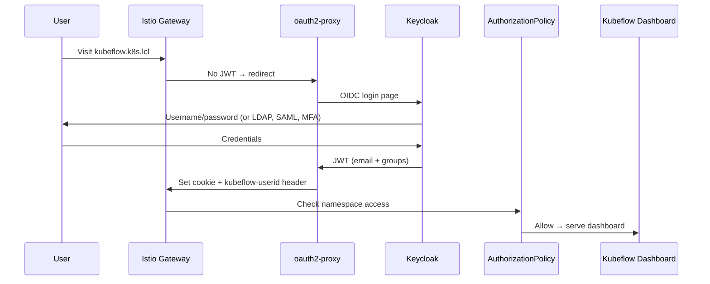
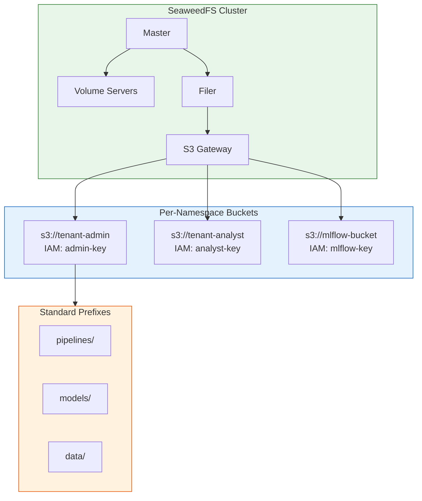

# Getting Started with KF4X: Deploy an Enterprise ML Platform in Under an Hour

*From zero to a fully authenticated, multi-tenant Kubeflow platform with per-namespace S3 storage — on any Kubernetes cluster.*


---

## What You'll Build

By the end of this guide, you'll have:

- **Kubeflow** (notebooks, pipelines, model serving, hyperparameter tuning)
- **Keycloak SSO** (LDAP, Entra ID, SAML, MFA — replaces Dex)
- **Per-namespace isolation** (ResourceQuota, LimitRange, RBAC, AuthorizationPolicies)
- **Per-namespace S3 storage** (SeaweedFS buckets with unique IAM credentials per tenant)
- **Declarative user management** (one CSV drives everything)

All running on any Kubernetes distribution — Kind, k3s, RKE2, EKS, AKS, GKE.

> **Note:** KF4X does not include a monitoring stack. Most clusters already run Prometheus/Grafana — KF4X is designed to integrate with your existing observability, not replace it.

---

## Prerequisites

- Kubernetes cluster (any distribution)
- Ingress controller (Traefik, Nginx, or cloud LB)
- Keycloak instance (running and reachable)
- CLI tools: `kubectl`, `kustomize` (v5+), `tofu` or `terraform`, `python3`, `openssl`

> **Need a cluster?** [k8s-cluster](https://github.com/AduraX/k8s-cluster) provides automated provisioning for [Kind](https://github.com/AduraX/k8s-cluster/tree/main/kindclus) (local dev — 3-node cluster with Calico, MetalLB, Traefik in minutes) and [RKE2](https://github.com/AduraX/k8s-cluster/tree/main/rke2) (production — HA, Longhorn storage, air-gapped support).

---

## Step 1: Keycloak Configuration (IaC)

KF4X manages Keycloak entirely via OpenTofu — realm, OIDC client, users, groups:

```bash
cd Kubeflow4X/Kubeflow4x_Phase-1/keycloak
cp terraform.tfvars.example terraform.tfvars
vi terraform.tfvars    # set Keycloak URL, admin password, client secret
tofu init && tofu apply
cd ..
```

This creates the Keycloak realm, OIDC client, and users from your `users.csv`. No clicking through the admin console.


*Keycloak SSO login page — the KF4X realm with username/password fields.*

### Federation Options

Keycloak supports pluggable identity federation via Tofu variables:

| Federation | Config | Use case |
|---|---|---|
| Local users | Default | Development, small teams |
| LDAP (OpenLDAP, AD) | `ldap_enabled = true` | Enterprise directory |
| Microsoft Entra ID | `entra_id_enabled = true` | Azure AD users |

Both can be enabled simultaneously — LDAP users + "Sign in with Microsoft" button.

---

## Step 2: Deploy Kubeflow (Phase 1)

```bash
cp config.env.example config.env
vi config.env          # set KEYCLOAK_CA_CERT, INGRESS_TYPE
vi profiles/users.csv  # add your users
./install.sh
```

### What `install.sh` Does

1. Loads configuration (Tofu output + config.env)
2. Clones Kubeflow manifests (configurable branch)
3. Sets up private registry mirror (if `REGISTRY_MODE=kyverno`)
4. Scans images with cosign + deploys verification policy
5. Generates auth config (oauth2-proxy, Istio JWT, logout chaining, ingress)
6. Builds and applies kustomize overlay
7. Waits for all pods
8. Creates user profiles from `users.csv`

### The Authentication Flow


*Figure: Authentication flow — Keycloak handles login, Istio validates the JWT, AuthorizationPolicies enforce namespace access.*
                            OR

*Kubeflow SSO + Authorization — the full access flow from user request through Keycloak to the dashboard.*

No Dex. No custom middleware. Standard OIDC with battle-tested components.

### Declarative User Management

One CSV controls everything:

```csv
email,profile,role,groups
admin@company.com,admin@company.com,owner,kf4x-admin-grp;kf4x-user-grp
analyst@company.com,analyst@company.com,owner,kf4x-user-grp
@kf4x-user-grp,admin@company.com,edit,
```

- **Owner rows** create Keycloak users + Kubeflow namespaces
- **`@group` rows** expand to all group members — each gets RBAC + AuthorizationPolicy
- Add a row, re-run `install.sh`. That's it.

### Namespace Isolation

Each user namespace gets:

| Resource | What it enforces |
|---|---|
| **Profile** | Namespace ownership |
| **ResourceQuota** | CPU, memory, GPU, PVC, pod limits |
| **LimitRange** | Default/max per-container resources |
| **RoleBinding** | Kubernetes RBAC (`kubeflow-edit` / `kubeflow-view`) |
| **AuthorizationPolicy** | Istio — only matching `kubeflow-userid` allowed |

---

## Step 3: Multi-Tenant Storage (Phase 1)

Multi-tenant S3 storage is included in Phase 1. The `install.sh` script deploys SeaweedFS alongside Kubeflow and Keycloak.

```bash
# Storage is deployed as part of Phase 1 install.sh above
# SeaweedFS admin credentials are configured in config.env
```

### What You Get



*Figure: Storage architecture — each tenant gets an isolated S3 bucket with unique IAM credentials. Shared service buckets support MLflow and Superset.*
                        OR

*SeaweedFS multi-tenant architecture — per-namespace S3 buckets with IAM-based isolation.*

- **SeaweedFS** deployed in its own namespace (master, volume, filer, S3 gateway)
- **Per-namespace S3 buckets** — each tenant gets their own bucket with unique IAM credentials
- **Bucket quotas** — configurable storage limits per namespace
- **Standard prefixes** — `pipelines/`, `models/`, `data/` per bucket
- **Shared service buckets** — `mlflow-bucket` and `superset-bucket` for Phase 2/3

### Stackable PodDefaults

Each S3 backend gets its own PodDefault with distinct env var prefixes. When creating a notebook, users select which storage(s) they need:

```
Notebook creation → check "access-seaweedfs"
  → Pod gets SWFS_ENDPOINT_URL_S3, SWFS_ACCESS_KEY_ID, SWFS_SECRET_ACCESS_KEY, SWFS_BUCKET
```

With add-ons, multiple PodDefaults stack — SeaweedFS for pipelines AND AWS S3 for production data in the same notebook.

Select the `access-seaweedfs` PodDefault when creating a notebook — S3 credentials are injected automatically.

### Storage Isolation

```
tenant-admin credentials → can access s3://tenant-admin/*
                         → CANNOT access s3://tenant-analyst/*  (AccessDenied)
```

Each credential set is scoped to its own bucket via SeaweedFS IAM.

Each credential set is scoped — tenant-admin's credentials cannot access tenant-analyst's bucket (AccessDenied).

---

## Verify Your Deployment

### Test 1: Dashboard Access

Browse to `https://kubeflow.<your-domain>`. You should see the Keycloak login page. After login, the Kubeflow Central Dashboard appears with your namespace.


*Kubeflow Central Dashboard — namespace selector showing tenant namespaces, sidebar menu, and notebook launcher.*

### Test 2: Run a Pipeline

Upload the [joke-pipeline.ipynb](https://github.com/AduraX/Kubeflow4X/tree/main/examples/phase-1-pipelines/joke-pipeline.ipynb) example notebook and run it. If the pipeline completes, your Phase 1 deployment is working.

### Test 3: S3 Storage

In a notebook with the `access-seaweedfs` PodDefault:

```python
import boto3, os

s3 = boto3.client('s3',
    endpoint_url=f"http://{os.environ['SWFS_ENDPOINT_URL_S3']}",
    aws_access_key_id=os.environ['SWFS_ACCESS_KEY_ID'],
    aws_secret_access_key=os.environ['SWFS_SECRET_ACCESS_KEY'])

s3.put_object(Bucket=os.environ['SWFS_BUCKET'], Key='test.txt', Body=b'Hello KF4X!')
print("Storage working!")
```

---

## Add-ons

The OSS release includes Keycloak + SeaweedFS. Additional backends and features are available as add-ons that `install.sh` auto-detects:

| Add-on | Phase | What it adds |
|---|---|---|
| Direct Entra ID | 1 | No-Keycloak authentication (oauth2-proxy → Entra ID directly) |
| MinIO backend | 1 | On-premises shared S3 storage |
| AWS S3 backend | 1 | Cloud production storage |
| Kyverno network policies | 1 | Cross-namespace traffic isolation |
| SeaweedFS remote gateway | 1 | On-prem to cloud sync |

---

## What's Next

With Phase 1 deployed, you have a secure, multi-tenant ML platform with isolated storage. The next article covers the ML capabilities: experiment tracking (MLflow), feature stores (Feast), BI dashboards (Superset + DuckDB), a data lakehouse (Iceberg), and GitOps deployment (ArgoCD).

- [KF4X Deep Dive: ML Capabilities](kf4x-deep-dive.md) — MLflow, Feast, Superset, Iceberg, ArgoCD
- [Quick Start & Operations Guide](https://github.com/AduraX/Kubeflow4X/tree/main/docs/quickstart.md) — install paths, day-2 operations, troubleshooting

---

## Links

- **GitHub:** [github.com/AduraX/Kubeflow4X](https://github.com/AduraX/Kubeflow4X)
- **Overview:** [KF4X Overview](kf4x-overview.md)
- **Example notebooks:** [examples/](https://github.com/AduraX/Kubeflow4X/tree/main/examples/)
- **License:** Apache 2.0

---

*KF4X is an open-source project by [Adura Abiona](https://www.linkedin.com/in/adura-abiona-2b832834/). Contributions welcome.*
