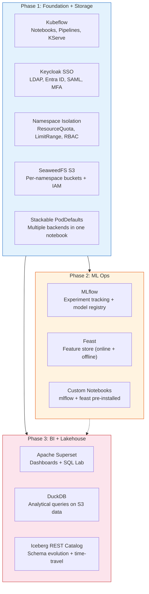
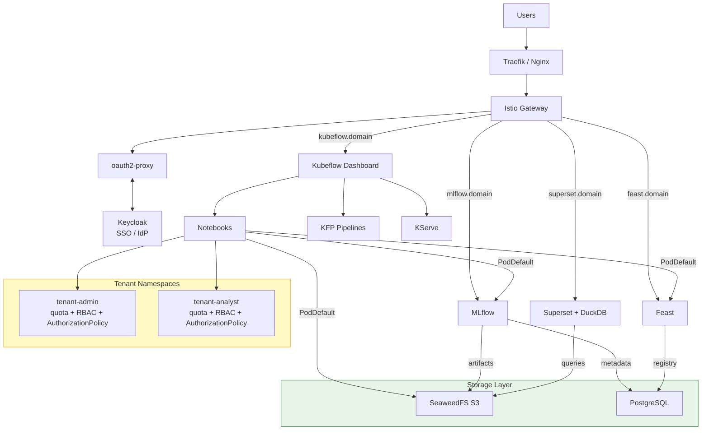

# Kubeflow4X: Building an Enterprise-Grade AI & Data Platform — One Phase at a Time

*Open-source. Kubernetes-agnostic. Incrementally deployed. From notebooks to production ML in three standalone phases.*


---

## The Problem

Kubeflow is the leading open-source ML platform on Kubernetes. It gives you notebooks, pipelines, model serving, hyperparameter tuning, and more. But out of the box, it ships with:

- **Dex** for authentication — fine for demos, not for enterprise (no LDAP, no MFA, no session management)
- **No storage isolation** — every namespace shares the same S3 credentials and bucket
- **No experiment tracking** — you need to bring your own MLflow
- **No feature store** — Feast needs to be integrated manually
- **No BI layer** — data scientists can't build dashboards without a separate tool

Building all of this on top of Kubeflow takes months. We know — we've done it.

**Kubeflow4X (KF4X)** — pronounced "Kubeflow for X" — is the result: an open-source, enterprise-grade AI & data platform that extends Kubeflow incrementally. Each phase adds a standalone capability. You pick what you need.

---

## Why Not Charmed Kubeflow, deployKF, or Vanilla?

| | Charmed Kubeflow | deployKF | Vanilla | **KF4X** |
|---|---|---|---|---|
| **Auth** | Dex | Dex | Dex | **Keycloak** (LDAP, Entra ID, SAML, MFA) |
| **Multi-tenancy** | Basic profiles | Basic profiles | Basic profiles | **Per-namespace S3 + IAM + quotas** |
| **ML stack** | Kubeflow only | Kubeflow only | Kubeflow only | **MLflow + Feast + Superset + DuckDB + Iceberg** |
| **Install model** | All-or-nothing | All-or-nothing | All-or-nothing | **Incremental phases** |
| **User management** | Manual | Manual | Manual | **One CSV drives everything** |
| **K8s lock-in** | MicroK8s / Juju | Any (Helm) | Any | **Any (kustomize + bash)** |

The short version: other distributions give you Kubeflow. KF4X gives you a **complete ML platform** — experiment tracking, feature stores, BI dashboards, a data lakehouse, and GitOps — with enterprise authentication and per-namespace isolation baked in from day one. And you install it incrementally, not all at once.

---

## Why Incremental Phases?

Most ML platform distributions ship as a monolithic install — you get everything or nothing. KF4X is different:

- **Reduce risk** — deploy and validate one capability at a time. If MLflow breaks, your Kubeflow + storage is still running.
- **Match team readiness** — not every team needs a feature store on day one. Start with notebooks + auth, add capabilities as the team grows.
- **Lower entry barrier** — Phase 1 alone is useful and takes 15 minutes. No need to understand 4 components before you can start.
- **Independent upgrades** — upgrade MLflow without touching Superset. Roll back Phase 3 without affecting Phase 2.
- **Resource control** — start small on a dev cluster (Phase 1), scale up for production (Phase 2-4).
- **Debugging isolation** — when something breaks, you know which phase introduced it.

---

## What You Get




*Figure 1: KF4X platform components across three phases. Each phase is standalone — install what you need.*


*Figure 1b: Lakehouse Platform Roadmap — three phases from foundation to BI.*

| Phase | What it adds | Key features |
|---|---|---|
| **[Phase 1](https://github.com/AduraX/Kubeflow4X/tree/main/Kubeflow4x_Phase-1/)** | Kubeflow + Keycloak + S3 Storage | Enterprise SSO (LDAP, Entra ID, SAML), declarative user management via CSV, namespace isolation, private registry support, cosign image scanning, per-namespace S3 buckets with SeaweedFS, unique IAM credentials per tenant, stackable PodDefaults for multiple storage backends, custom notebook images |
| **[Phase 2](https://github.com/AduraX/Kubeflow4X/tree/main/Kubeflow4x_Phase-2/)** | MLflow + Feast | Experiment tracking, model registry, feature store, PostgreSQL, Keycloak-authenticated subdomains |
| **[Phase 3](https://github.com/AduraX/Kubeflow4X/tree/main/Kubeflow4x_Phase-3/)** | Superset + DuckDB + Iceberg | BI dashboards with Keycloak OAuth, DuckDB analytical queries against S3 data, SQL Lab, Iceberg lakehouse with REST Catalog, Nessie + Spark + Trino add-ons |
| **[ArgoCD](https://github.com/AduraX/Kubeflow4X/tree/main/argocd/)** | GitOps Deployment | GitOps deployment with ArgoCD, Keycloak SSO, RBAC, custom branding add-on |

All phases and ArgoCD are ready for deployment.

---

## Architecture



*Figure 2: Full KF4X architecture — Keycloak SSO at the gate, Istio routing to all services, SeaweedFS + PostgreSQL as the storage backbone, isolated tenant namespaces.*

Every service gets its own Keycloak-authenticated subdomain. Users log in once and access everything — Kubeflow, MLflow, Feast, Superset — with the same credentials.

---

## See It In Action

KF4X ships with example notebooks you can run on the platform. Here's what a typical workflow looks like.

### 1. Your First Pipeline (Phase 1)

The simplest KFP pipeline — three components passing data:

```python
import kfp.dsl as dsl

@dsl.component
def generate_joke() -> str:
    import pyjokes
    return pyjokes.get_joke()

@dsl.component
def count_words(input: str) -> int:
    return len(input.split())

@dsl.pipeline(name="joke_pipeline")
def pipeline():
    joke = generate_joke()
    count = count_words(input=joke.output)
```

Create a notebook, paste this, and submit it to the Kubeflow Pipeline engine. If it runs, your Phase 1 deployment is working.


*The Kubeflow Central Dashboard after Keycloak SSO login — namespace selector, sidebar menu, and notebook launcher.*

> **Try it:** [joke-pipeline.ipynb](https://github.com/AduraX/Kubeflow4X/tree/main/examples/phase-1-pipelines/joke-pipeline.ipynb)

### 2. Track Experiments with MLflow (Phase 2)

Train a model and log everything — parameters, metrics, the model itself — to MLflow:

```python
import mlflow
from sklearn.ensemble import RandomForestRegressor
from sklearn.datasets import load_diabetes
from sklearn.metrics import mean_squared_error

mlflow.set_tracking_uri(os.getenv("MLFLOW_TRACKING_URI"))

diabetes = load_diabetes()
X_train, X_test, y_train, y_test = train_test_split(diabetes.data, diabetes.target)

with mlflow.start_run(run_name="diabetes-rf"):
    model = RandomForestRegressor(n_estimators=100, max_depth=5)
    model.fit(X_train, y_train)

    mlflow.log_param("n_estimators", 100)
    mlflow.log_metric("mse", mean_squared_error(y_test, model.predict(X_test)))
    mlflow.sklearn.log_model(model, "model")
```

The `MLFLOW_TRACKING_URI` is injected automatically by the `access-mlflow` PodDefault. No URLs to remember, no credentials to configure. Artifacts are stored in your namespace's SeaweedFS bucket — isolated from other tenants.

Open `https://mlflow.<your-domain>` and you'll see your experiment, metrics, and model artifacts.


*MLflow + Feast architecture — experiment tracking, feature serving, and model registry.*

> **Try it:** [1st-run.ipynb](https://github.com/AduraX/Kubeflow4X/tree/main/examples/phase-2-mlflow/1st-run.ipynb) — MLflow basics with model registry and version aliases

### 3. Serve Features with Feast (Phase 2)

Define features, materialize them to the online store, and retrieve them for inference:

```python
from feast import FeatureStore

store = FeatureStore(repo_path=".")

# Get online features for a prediction request
features = store.get_online_features(
    features=[
        "income_demographic:age",
        "income_demographic:education_num",
        "income_occupation:hours_per_week",
    ],
    entity_rows=[{"person_id": 1001}]
).to_dict()
```

The `access-feast` PodDefault points your notebook to the Feast server. Features are defined once and served consistently for both training and inference.

> **Try it:** [Feast-Run.ipynb](https://github.com/AduraX/Kubeflow4X/tree/main/examples/phase-2-feast/Feast-Run.ipynb) — end-to-end feature store setup

### 4. End-to-End: Pipeline → MLflow → KServe (Phase 1 + 2)

The real power is combining everything. The [e2eWine.ipynb](https://github.com/AduraX/Kubeflow4X/tree/main/examples/phase-1-pipelines/e2eWine.ipynb) notebook builds a complete ML workflow:

```
Download data → Preprocess → Train (ElasticNet + MLflow tracking)
    → Register model → Deploy to KServe → Run inference
```

One notebook, one pipeline, from raw data to a live inference endpoint — all running on KF4X.


### 5. Query S3 Data with DuckDB (Phase 3)

Superset's SQL Lab lets you query data directly from SeaweedFS using DuckDB:

```sql
SELECT education, AVG(hours_per_week) as avg_hours, COUNT(*) as count
FROM read_parquet('s3://tenant-admin/data/income_data.parquet')
GROUP BY education
ORDER BY avg_hours DESC;
```

Or in a notebook via the `access-duckdb` PodDefault:

```python
import duckdb, os

conn = duckdb.connect()
conn.execute(f"SET s3_endpoint='{os.environ['DUCKDB_S3_ENDPOINT']}'")
conn.execute(f"SET s3_access_key_id='{os.environ['DUCKDB_S3_ACCESS_KEY']}'")
conn.execute(f"SET s3_secret_access_key='{os.environ['DUCKDB_S3_SECRET_KEY']}'")

result = conn.execute("""
    SELECT * FROM read_parquet('s3://tenant-admin/data/income_data.parquet')
    LIMIT 10
""").fetchdf()
```

No ETL, no data warehouse — DuckDB queries parquet files directly in S3.


*Superset + DuckDB — BI dashboards and analytical queries against SeaweedFS S3.*

### 6. Build a Data Lakehouse with Iceberg + REST Catalog (Phase 3)

Query and manage Iceberg tables through the built-in REST Catalog:

```bash
# List namespaces in the REST Catalog
curl -s http://iceberg-rest.lakehouse.svc:8181/v1/namespaces | jq

# List tables in a namespace
curl -s http://iceberg-rest.lakehouse.svc:8181/v1/namespaces/lakehouse/tables | jq

# Load table metadata (schema, partitioning, snapshots)
curl -s http://iceberg-rest.lakehouse.svc:8181/v1/namespaces/lakehouse/tables/sales | jq '.metadata.schema'
```

The REST Catalog is the vendor-neutral Iceberg catalog included in the OSS release. Any Iceberg-compatible engine (PyIceberg, DuckDB, Trino, Spark) can connect to it.

> **Add-on: Spark + Nessie** — For batch ETL and Git-like table versioning, install the Spark and Nessie add-ons. With those in place you can use SparkApplication templates and branch-based data experimentation:

```python
from pyspark.sql import SparkSession

spark = SparkSession.builder \
    .config("spark.sql.catalog.nessie", "org.apache.iceberg.spark.SparkCatalog") \
    .config("spark.sql.catalog.nessie.catalog-impl", "org.apache.iceberg.nessie.NessieCatalog") \
    .config("spark.sql.catalog.nessie.uri", "http://nessie.nessie.svc:19120/api/v2") \
    .getOrCreate()

# Create an Iceberg table
spark.sql("""
    CREATE TABLE IF NOT EXISTS nessie.lakehouse.sales (
        date DATE, product STRING, quantity INT, revenue DOUBLE
    ) USING iceberg
""")

# Time-travel: query a previous version
spark.sql("SELECT * FROM nessie.lakehouse.sales VERSION AS OF 1")
```

> **Try it:** [iceberg-quickstart.py](https://github.com/AduraX/Kubeflow4X/tree/main/examples/phase-3-lakehouse/iceberg-quickstart.py) — create tables, insert data, time-travel, branch operations

---

## Key Design Decisions

### One CSV to Rule Them All

A single `users.csv` drives everything:

```csv
email,profile,role,groups
admin@company.com,admin@company.com,owner,ml-admin;ml-users
analyst@company.com,analyst@company.com,owner,ml-users
@ml-users,analyst@company.com,edit,
```

This one file creates:
- Keycloak users and groups (via OpenTofu)
- Kubeflow namespaces with ResourceQuota + LimitRange
- Per-namespace S3 buckets with unique IAM credentials
- RoleBindings and AuthorizationPolicies for access control

Add a row, re-run `install.sh`. That's it.

### Stackable PodDefaults

Each service gets its own PodDefault with distinct environment variable prefixes:

| PodDefault | Env vars | What it connects to |
|---|---|---|
| `access-seaweedfs` | `SWFS_*` | SeaweedFS S3 (Phase 1) |
| `access-mlflow` | `MLFLOW_*` + `AWS_*` | MLflow tracking + S3 artifacts (Phase 2) |
| `access-feast` | `FEAST_*` | Feast feature server (Phase 2) |
| `access-duckdb` | `DUCKDB_S3_*` | DuckDB S3 queries (Phase 3) |

Select multiple PodDefaults when creating a notebook — they stack without conflicts. A single notebook can use SeaweedFS for pipeline artifacts, MLflow for experiment tracking, Feast for features, and DuckDB for analytical queries.

### Supply Chain Security

KF4X secures the container supply chain end-to-end — from image sources to runtime — without sacrificing workload availability.


*Full supply chain protection — from public registries through cosign scanning, Kyverno registry mirroring, and admission verification to runtime workloads.*


*Five layers of defense: source control, build-time scanning, admission verification, audit trail, and fail-open availability.*

### Pluggable IAM

Two authentication modes:

- **Keycloak (default)** — full SSO with optional LDAP (OpenLDAP, AD) and Microsoft Entra ID federation
- **Direct Entra ID (add-on)** — no Keycloak, oauth2-proxy connects straight to Azure

### Add-on Architecture

The OSS release includes the core platform. Enterprise features are available as add-ons that `install.sh` auto-detects:

| Add-on | Phase | What it adds |
|---|---|---|
| MinIO backend | Phase 1 | On-premises shared S3 storage |
| AWS S3 backend | Phase 1 | Cloud production storage |
| Kyverno network policies | Phase 1 | Cross-namespace traffic isolation |
| SeaweedFS remote gateway | Phase 1 | On-prem to cloud sync |
| Direct Entra ID | Phase 1 | No-Keycloak authentication |
| Keycloak webhook | Phase 1 | Real-time user provisioning + CronJob sync |
| Feast UI | Phase 2 | Web interface for feature store |
| Redis online store | Phase 2 | High-performance feature serving |
| Row-Level Security | Phase 3 | Superset RLS per Keycloak group |
| Nessie catalog | Phase 3 | Git-like table versioning + branch operations |
| Spark + Iceberg | Phase 3 | Batch ETL, SparkApplication templates |
| Trino query engine | Phase 3 | Interactive queries + RLS enforcement |
| AWS Glue Catalog | Phase 3 | Native AWS catalog |
| Nessie RBAC | Phase 3 | Branch permissions per Keycloak group |
| Custom branding | ArgoCD | Dashboard logo + title, sign-in page logo |

Add-ons are included in the repository. Each phase's `install.sh` auto-detects and runs them when present.

### Why No Monitoring Stack?

KF4X intentionally does not ship Prometheus, Grafana, or any observability tooling. Most production Kubernetes clusters already run a monitoring stack managed by the platform or SRE team. Deploying a second one would create conflicts — duplicate metrics, alert fatigue, and wasted resources. KF4X is designed to run alongside your existing observability, not compete with it.

---

## Quick Start

> **Need a cluster first?** See [k8s-cluster](https://github.com/AduraX/k8s-cluster) — automated provisioning for [Kind](https://github.com/AduraX/k8s-cluster/tree/main/kindclus) (local dev) or [RKE2](https://github.com/AduraX/k8s-cluster/tree/main/rke2) (production with HA, Longhorn, air-gapped).

```bash
git clone https://github.com/AduraX/Kubeflow4X.git
cd Kubeflow4X

# Phase 1: Kubeflow + Keycloak SSO + S3 Storage
cd Kubeflow4x_Phase-1/keycloak && cp terraform.tfvars.example terraform.tfvars
vi terraform.tfvars && tofu init && tofu apply && cd ..
cp config.env.example config.env && vi config.env
./install.sh

# Phase 2: MLflow + Feast
cd ../Kubeflow4x_Phase-2
docker build -f mlflow/mlflow.dockerfile -t kf4x/mlflow:v2.22.1 mlflow/
cp config.env.example config.env && vi config.env
./install.sh

# Phase 3: Superset + DuckDB + Iceberg
cd ../Kubeflow4x_Phase-3
docker build -f superset/superset.dockerfile -t kf4x/superset-duckdb:4.1.4 superset/
cp config.env.example config.env && vi config.env
./install.sh

# ArgoCD GitOps (optional)
cd ..
./bootstrap.sh
```

Each phase takes 5-15 minutes. Install them in order, or install only what you need.

---

## What's Coming

All four phases are scaffolded with code, configuration, articles, and tests. Deploy them incrementally — each phase is standalone.

---

## Who Is This For?

- **ML platform teams** building internal ML infrastructure
- **Data scientists** who want experiment tracking, feature stores, and notebooks without ClickOps
- **DevOps/SRE teams** deploying Kubeflow at scale with enterprise auth
- **Startups** that need a production ML platform without a $100K/year SaaS bill

---

## Get Help

KF4X is open-source under Apache 2.0. Use it freely.

Need help with enterprise deployment, custom add-ons, or scaling KF4X for your team? **[Adura Abiona](https://www.linkedin.com/in/adura-abiona-2b832834/)** built this platform and provides consulting and implementation services — [let's talk](https://www.linkedin.com/in/adura-abiona-2b832834/).

---

## Links

- **GitHub:** [github.com/AduraX/Kubeflow4X](https://github.com/AduraX/Kubeflow4X)
- **Getting Started:** [Deploy KF4X (Phase 1)](kf4x-getting-started.md)
- **Deep Dive:** [ML Capabilities (Phase 2-4)](kf4x-deep-dive.md)
- **Example notebooks:** [examples/](https://github.com/AduraX/Kubeflow4X/tree/main/examples/)
- **License:** [Apache 2.0](https://github.com/AduraX/Kubeflow4X/blob/main/LICENSE)

---

*KF4X is an open-source project by [Adura Abiona](https://www.linkedin.com/in/adura-abiona-2b832834/). Contributions welcome.*
