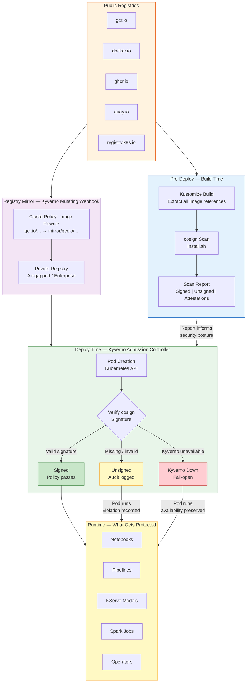
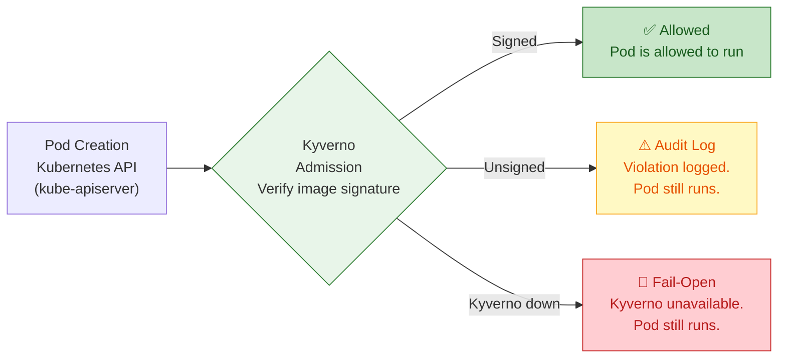
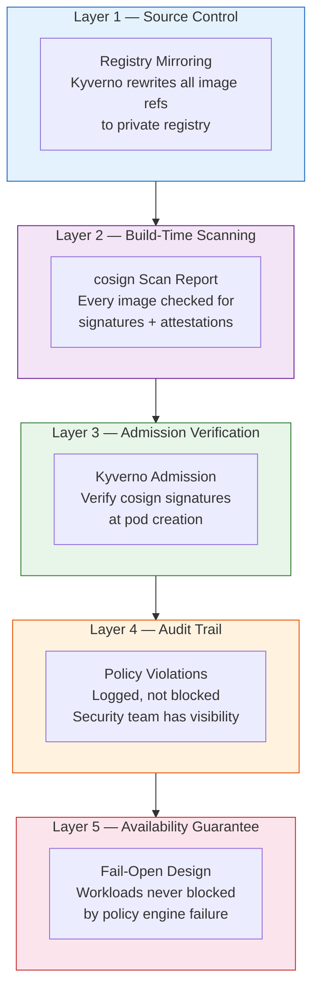

# KF4X Supply Chain Security — Mermaid Diagrams

## Diagram 1: Full Supply Chain Security Pipeline

## Diagram 2: Admission Decision Flow (matches kyverno-policy.png)

## Diagram 3: Defense-in-Depth Layers

